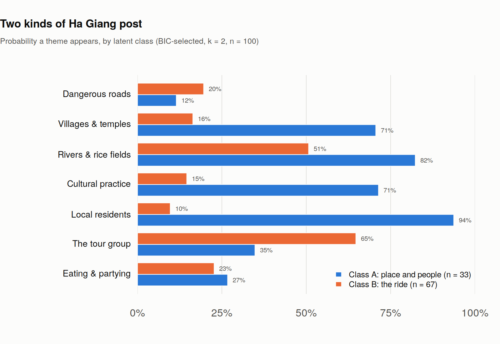

# Ha Giang Loop: social media and adventure travel

A reanalysis of my own 2025 research on how social media shapes tourism on the Ha
Giang Loop, a motorcycle route in northern Vietnam. I ran the original study through
Kenyon College's Summer Science Scholars program, advised by Prof. Sam Pack, coding
100 social media posts and surveying 61 travellers.

I got the headline finding wrong. This repository shows what I got wrong, corrects
it, and reports the three results that survive.

## What I got wrong

I claimed that travellers posting independently were more likely to depict local
residents than travellers in tour groups: 49% against 27%, χ²=4.08, p=.043.

I ran that test on `Sender_Type`, which records whether the *account* belongs to a
traveller or a tour operator. It says nothing about how anyone travelled. The
variable I described in the axis label is `Tour_Group`, a different column, and I
never tested it (see [`data/codebook.md`](data/codebook.md)).

My percentages were wrong too. For that test they are 44.4% and 24.3%.

And the association is platform, not account type. Instagram is 72% traveller
accounts against TikTok's 54%, and Instagram shows local residents more often
whoever posts. Put platform in the model and account type falls from p=.044 to
p=.098.


I also ran fourteen bivariate tests and reported one. Under Holm correction the one
I reported ranks fourth and doesn't survive, at p_holm = .49. Two others do.

## Agencies sell the group; travellers post the solo trip

Tour operator accounts show a visible tour group in 76% of posts, against 43% for
traveller accounts. OR = 5.04, p = .001. Unlike my original finding this one doesn't
move when platform enters the model, and it survives Holm correction at p = .020.

This is the mechanism behind the complaints in my interview data. Operators
advertise a group experience while the free advertising their customers produce
shows a trip that looks solitary.

## Two kinds of post, and two thirds leave people out

A latent class model over the seven theme codes selects two classes by BIC: 871.9
at k=2, against 891.8 at k=1 and 893.8 at k=3, with mean assignment certainty of .94.



Class A shows a place with people in it. Class B shows the ride and the riders.
Class B holds 67 of the 100 posts, and 84% of agency posts land there against 57%
of traveller posts (χ² = 6.33, p = .012).

Platform compresses content independently of who's posting. Instagram posts carry
3.10 themes on average against TikTok's 2.12 (Poisson, p = .004), while account
type has no effect on breadth at all (p = .78).

## TikTok recruits, Instagram archives

I asked every respondent both where they found the Loop and where they post about
it, so the comparison is paired within person.


27 found the Loop through TikTok. Two of them post to TikTok. Nine found it through
Instagram and 55 post to Instagram. Exact McNemar gives p = 2.7e-05 and 3.5e-13.

The feedback loop I named in the original title is real, but it isn't one loop.
Discovery and publication happen on different platforms, and those platforms carry
measurably different pictures of the same place.

## The gap that beats all of it


All 61 respondents rated "I enjoyed interactions with locals, staff and easyriders"
at 4 or 5. Two named culture or socialising as a reason for going, against 40 who
named scenery. And 37% of posts contain a local resident at all.

People come for the landscape, unanimously enjoy the people, and post the landscape.

## What doesn't replicate, and one honest negative

I reported that perceived accuracy of the Loop's social media portrayal was
identical whether travellers heard about it from friends or from other sources,
p ≈ .99. That reproduces exactly: 4.21 against 4.21, p = .995. Split the same
variable by social-media discovery instead and it goes the other way, 4.41 against
4.00, p = .078, d = 0.47. The null belongs to one comparison and I should have
reported it as that comparison, not as "channel doesn't matter."

Nothing I measured predicts intention to return. Accommodation satisfaction is the
strongest correlate at r = .28, and 24 of 61 respondents are neutral. A destination
that nearly everyone recommends and few plan to revisit is a finding, just not a
comfortable one.

## Limitations

I recruited all 61 respondents from a single homestay. The demographic profile they
produce, young and European and travelling with friends, may belong to that
operator's clientele rather than to Loop travellers generally. I didn't say so on
the poster.

I coded all 100 posts myself with no second pass, so everything in the first two
findings rests on unchecked coding.
[`R/05_reliability.R`](R/05_reliability.R) writes a 20-post blind recode sample and
computes Cohen's kappa once I've filled it in. Until then the content results are
provisional.

My survey respondents didn't write the posts I coded, so the representation gap
above compares two populations rather than two measurements of one. And nothing
here identifies a causal feedback loop. The data are consistent with one.

## Reproducing

Base R 4.3 or later, no packages. I implemented the latent class model directly in
[`R/03_latent_class.R`](R/03_latent_class.R) rather than pulling in `poLCA`, so the
whole repository runs anywhere R does.

```bash
Rscript R/01_content_tests.R     # 14 tests, Holm-corrected
Rscript R/02_logistic_models.R   # the confounding check
Rscript R/03_latent_class.R      # model selection and class profiles
Rscript R/04_survey.R            # paired platform tests, representation gap
Rscript R/05_reliability.R       # generates the recode sample (not yet completed)
Rscript R/06_figures.R           # all four figures
```

Or `bash run_all.sh`. Numbers land in `results/`, figures in `figures/`. Every
figure above is generated by script; I made none of them by hand.

```
data/     content_coding.csv, survey_responses.csv (de-identified), codebook.md
R/        00_prep.R and the six analysis scripts
results/  csv output from each script
figures/  png output from 06_figures.R
```

## Data and ethics

The survey file here is de-identified. I deleted the interview-volunteer email
column, cut timestamps to dates, and replaced two easyriders named in a free-text
response. The raw Google Forms export holds five email addresses and isn't in this
repository. The posts I coded are public content, and the file records themes
rather than URLs, handles or captions.

## License

Code MIT. Data CC BY-NC 4.0.
